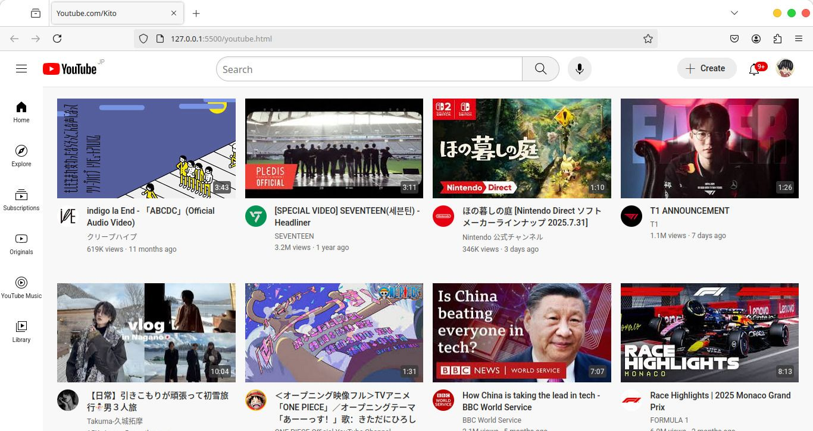

# ▶️ YouTube Homepage Clone

A clean and responsive **YouTube homepage** built with **HTML5** and **CSS3**.  
This project is part of my front-end development learning journey and showcases my skills in **structuring layouts**,and **styling with CSS**.

---

## 📝 Project Overview

This is a **static front-end recreation** of the YouTube homepage with no backend functionality. The main goal of this project was practice **HTML and CSS extensively**, focusing on mastering HTML syntax and exploring different styling and layout concepts in CSS. It also gave me the opportunity to develop my **UI** and **UX design** skills by studying the fundamentals that large and well-known websites use. 

For the design, I combined elements from **both old and new YouTube layouts** to create something familiar yet unique.
> ⚠️ This project is **desktop-only**

---

## 🖼️ Preview



---

## 📂 Project Structure
Youtube_Project/
│── /icons # Icons used across the page
│── /profile-pictures # Profile images for channel previews
│── /styles # CSS stylesheets
│ ├── general.css # Global styles
│ ├── header.css # Header section styles
│ ├── sidebar.css # Sidebar styles
│ └── video.css # Video grid & thumbnails styling
│── /thumbnails # Video thumbnails & Page_View screenshot
│ └── Page_View.jpeg
│── README.md # Project documentation
│── youtube.html # Main HTML file

---

## 🛠️ Built With

- **HTML5** – Semantic structure and accessibility
- **CSS3** – Styling, layout, and hover animations
- **Flexbox/Grid** – Responsive alignment
- **Google Fonts & Icons** – Clean, modern look

---

## 📌 Learning Goals

- Practice **HTML and CSS fundamentals**
- Explore **layout design techniques**
- Improve **UI feedback**
  
---

## 🧑🏻‍💻 JavaScript + ReactJS Coming soon..

---

### 🌐 Clone the repository
```bash
git clone https://github.com/DerikFlamel/Youtube-Project.git
